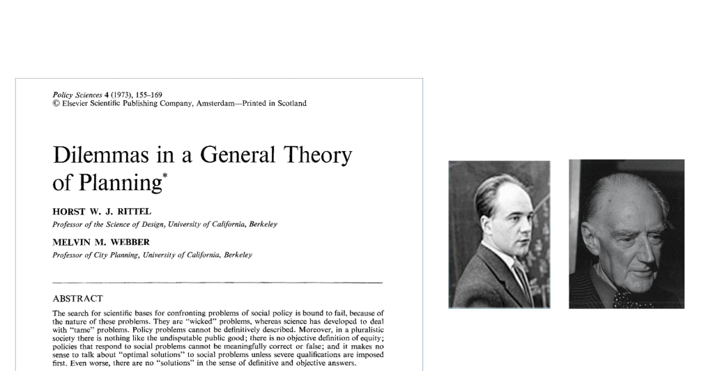
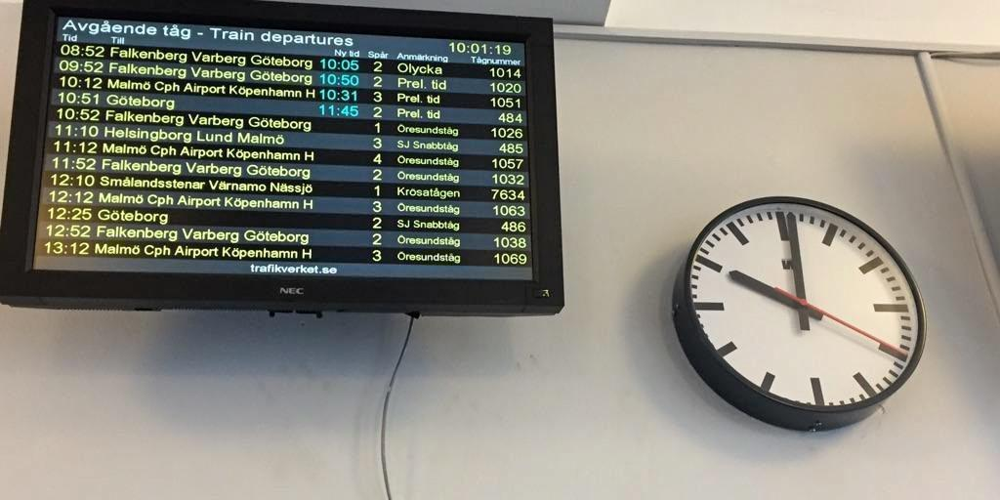
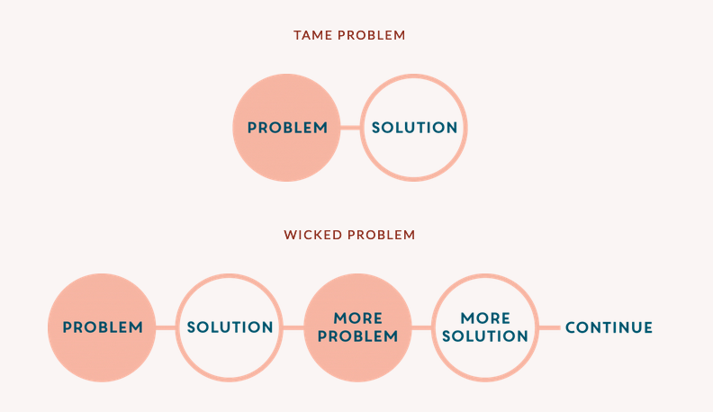
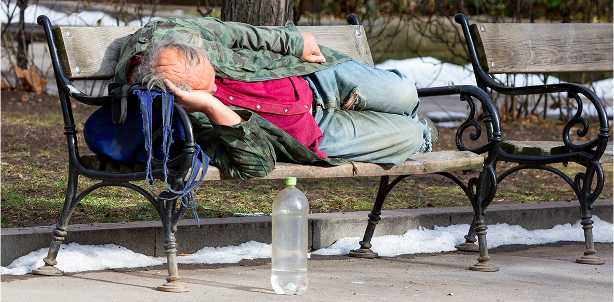
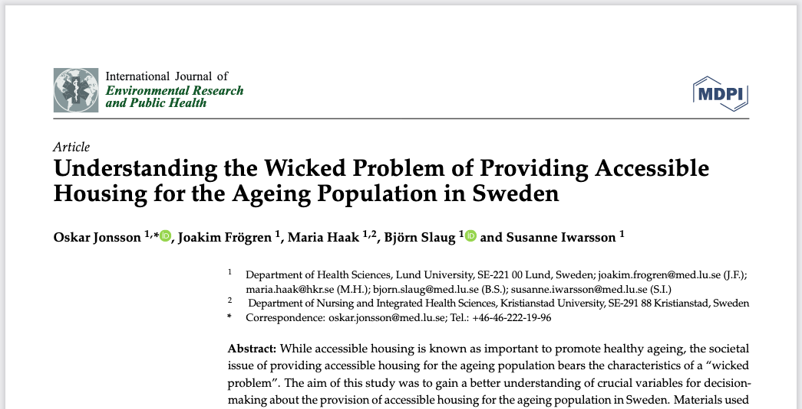
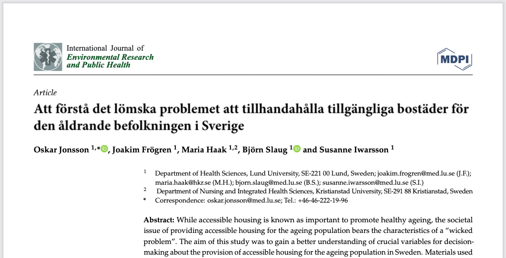

```{r xaringan-themer, include=FALSE, warning=FALSE}
library(xaringanthemer)
style_mono_accent(
  base_color = "#000080",
  header_font_family = ("TeX Gyre Termes"),
  header_font_url    = "http://fonts.cdnfonts.com/css/tex-gyre-termes",
  text_font_google   = google_font("Roboto"),
  text_font_size     = "28px",
  code_font_google   = google_font("Fira Mono")
)
```


class: userage-slide, title-slide-custom

# Samverkan som ett sätt att förstå lömska problem

### Joakim Frögren
### Institutionen för hälsovetenskaper, Lunds universitet
### 2021-09-09


???

Tack Susanne och Hej allihoppa. Ja, jag tänkte prata lite om samverkan som ett sätt att förstå lömska problem med utgångspunkt i den första artikeln i min avhandling. 

---

class:

## Lömska problem?


--

- Motsvarar engelskans *Wicked problems*

--

- Alternativ: *vilda*, *elaka*, *stygga* problem

--

- Motsatsen till *tama* problem

???

Lömska problem vad menar jag med det? Ja, det är egentligen den svenska översättningen av vad som på engelska heter 'wicked problem'. Det översätts ibland även med  *vilda*, *elaka*, *stygga* problem


---

## Wicked problems. Rittel & Webber (1973)


???

REDAN PÅ 1970-TALET insåg två stadsplanerare vid University of California i Berkley, USA, nämligen Horst Rittel och Melvin Webber, att det är skillnad på samhällsproblem och samhällsproblem. Lång ifrån allt går att lösa med god vilja och rätt planering.


De poängterade att många problem är hanterbara, eller "tama". De tama problemen kan tämjas, och kan förstås och definieras ganska enkelt. De påminner om andra problem som blivit lösta förut, de tål att man gör experiment med dem, man märker när man har löst dem och det går att avgöra i efterhand om lösningen var bra eller dålig.

Exempel på tama problem är...

---



???
tågförseningar, 

---


???
förgiftat dricksvatten eller

---


## Tama problem


???

Nog så knepiga utmaningar allihop, men trots att har de en lösning som också går att mäta. Och de är således  enkla jämfört med de så kallat "lömska" samhällsproblemen.

---

## Tama vs. lömska problem


???

De lömska problemen går ofta inte ens att definiera. De är tvetydiga, komplexa och svåra att avgränsa. Så fort de diskuteras rör de upp starka känslor eller skapar moralisk och politisk oenighet. Kanske råder inte ens enighet om att problemen finns eller vad de egentligen handlar om. Några exempel är...

---


???
sociala orättvisor

---


???
organiserad brottslighet

---


???
klimathot.  I en av de artiklar som kommer att ingå i min avhandling arguneterar vi också för att tilhandahålandet av tillgängliga bostäder är ett lömskt problem. 

---


???

---

class: 





???

var något som vi använde i en av de artiklar som kommer att ingå i min avhandling. Titeln på den artikeln var "Understanding..."

---

class: 




???
Och översatt till svenska "Att förstå det lömska problemet att tillhandahålla tillgängliga bostäder för den åldrande befolkningen i Sverige"


I vår argumentation för att detta komplexa problem kan sägas vara ett lömskt problem tog vi stöd av Rittel & Webers redan nämnda artikel. Som ett sätt att definiera lömska problem, listade Rittel & Webber 10 kännetecken eller egenskaper som utmärker ett lömskt problem.

---

### Definition av lömskt problem (Rittel & Webber, 1973)
--

1. Det finns ingen definitiv problemformulering.

--
2. Det finns ingen stoppregel.

--
3. Lösningarna är inte sanna-falska, utan bra-dåliga. 

--
4. Det finns inget omedelbart och inget ultimat test av en lösning. 

--
5. Varje försök till lösning är en unik åtgärd; eftersom möjlighet saknas att lära sig genom trial-and-error har varje försök stor inverkan.

--
6. En uttömmande uppsättning potentiella lösningar eller åtgärder saknas

--
7. Varje lömskt problem är i huvudsak unikt. 

--
8. Varje lömskt problem kan anses vara ett symptom på ett annat problem.


--
9. Diskrepansen i synen på lömska problem kan ha många orsaker. Valet av förklaring avgör typen av problemlösning.

--
10. Planeraren har ingen rätt att ha fel. 
???

---

## Hur såg samverkan i studien ut?

--
* Tre forskningscirkel-tillfällen à 3 timmar

--
* Tolv personer deltog, representerande:

--
  + Seniorer 
  + Kommunala fastighetsbolag
  + Bostadsanpassning
  + Hjälpmedelsförskrivning
  + Arkitekter
  + Hälso- och sjukvården
  + Affärsutvecklare
  + Forskare
  
---

## Problemet belyst ur fem dimensioner

+ Biofysisk
+ Socioekonomisk
+ Etisk
+ Estetisk
+ Empatisk


---

## Biofysisk

+ Olika åsikter om innebörden och definition av bostadstillgänglighet råder 

--
+ Systematiska inventeringar är motiverade men måste vara omfattande 

--
+ Bevis och övertygande argument för bostadstillgänglighet är viktiga men saknas

---

## Socioekonomisk

+ Policies kring rätten att åldras i sin hemmiljö betydande för beslutsfattande

--
+ Organisation och fördelning av resurser lider av "silotänkande" 

--
+ Varierande metoder och konkurrerande prioriteringar bland aktörerna

--
+ Avsaknad av tydliga riktlinjer och mål för tillgänglighet 

---

## Etisk

+ Balans mellan individuell valfrihet och samhällelig solidaritet 

--
+ Bostadsbolagens har tvetydigt socialt ansvar 

--
+ Balans mellan bostadstillgänglighet och prisvärdhet

---

## Estetisk 

+ Åtgärder med avsikt att tillhandahålla tillgängligt boende kan äventyra attraktivitet 

---

## Empatisk

+ Brist på empati leder till bristande förståelse för andras situationer och perspektiv 

---

## Några tankar utifrån studien

+ Lömska problem kan inte kan förstås fullständigt 

--
+ Lömska problem kan inte ges en fullödig lösning

--
+ Men... samverkansforskning med adekvata aktörer kan nysta upp problematiken och belysa många aspekter

--
+ ...och därmed minska risken för att något väsentligt ignoreras i arbetet mot en lösning.

---

class: userage-slide, title-slide-custom

## Tack för uppmärksamheten!

### joakim.frogren@med.lu.se


