\Large

## 1. Leonard Cohen föddes för 90 år sedan...
I en ny norsk tv-serie skildras Leonards kärlek till en norsk kvinna som han träffade på den grekiska ön Hydra. Vad hette norskan i förnamn?

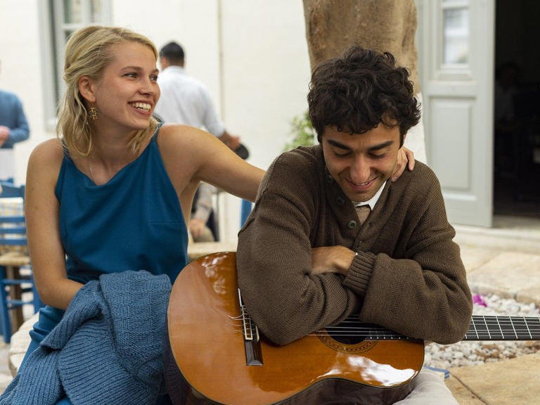

[1.] Susanne \newline
[X.] Marianne \newline
[2.] Marie

\newpage

## 2. För 90 år sedan grundades Volvo...
Vad hette Volvomodellen som rattades av Roger Moore i serien Helgonet?

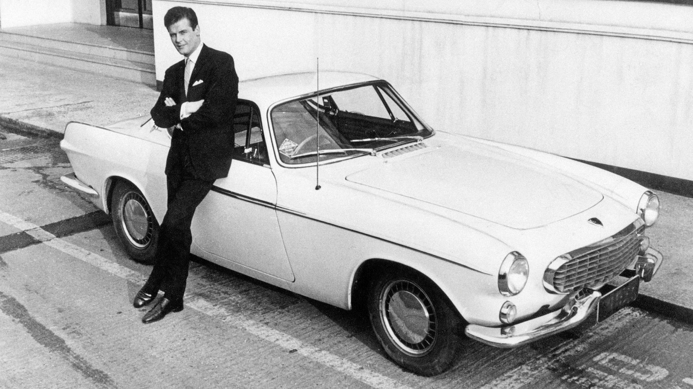

[1.] Duett \newline
[X.] 66 \newline
[2.] P1800 

\newpage

## 3. Under 90 år har Televerket/Telia distribuerat tjänsten Fröken Ur...
Vilket nummer ska du slå för att komma till Fröken Ur och få veta vad klockan är?

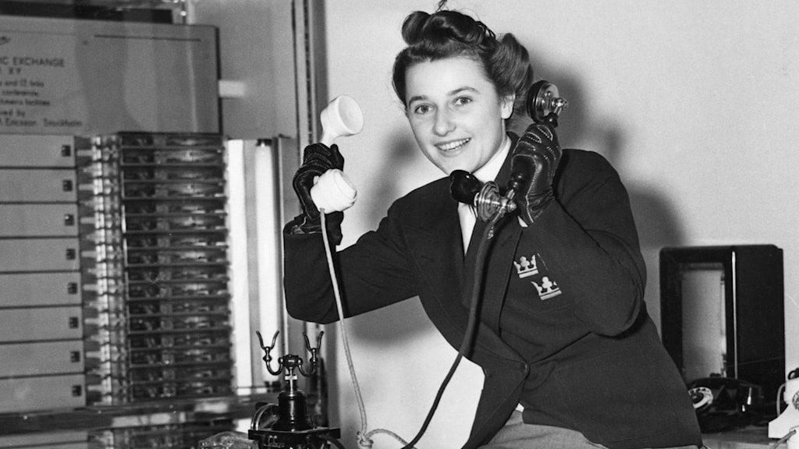

[1.] 90 100 \newline
[X.] 90 200 \newline
[2.] 90 510

\newpage

## 4. För 90 år sedan skapades den första versionen av Kalle Anka...
Vad heter Kalle Anka i Danmark?

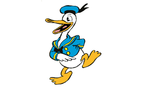

[1.] Nicholas Næb \newline
[X.] Anders And \newline
[2.] Donald Duck

\newpage

## 5. I år firar säkerhetsföretaget Securitas 90 år
Deras logotyp innehåller tre prickar. Vad står de tre prickarna för?

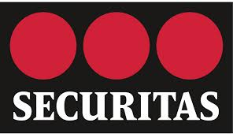

[1.] Ärlighet, vaksamhet och hjälpsamhet \newline
[X.] Frihet, jämlikhet och broderskap \newline
[2.] Säkerhet, snabbhet och styrka

\newpage

## 6. I år firar Stryktipset 90 år 
Stryktipset hade premiär för 90 år sedan, den 20 oktober 1934. Spelet  går ut på att tippa 1, X eller 2 (hemmaseger, oavgjort, bortaseger) i 13 fotbollsmatcher, främst hämtade från Sverige och England. Everton FC är ett engelskt lag i högsta ligan. Från vilken stad kommer laget?

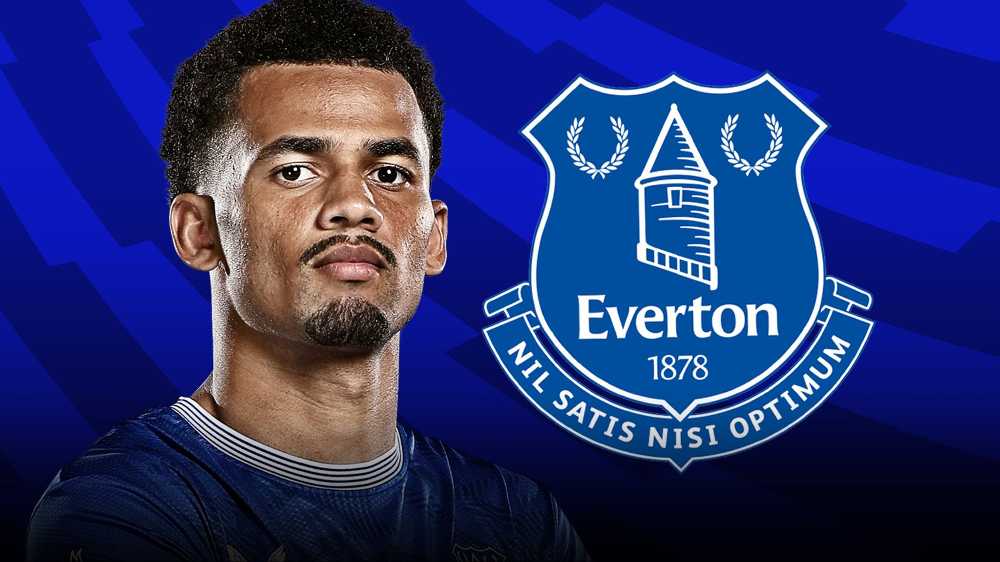

[1.] London \newline
[X.] Birmingham \newline
[2.] Sheffield  

\newpage

## 7. I år för 90 år sedan bildades Folkpartiet, idag Liberalerna
En känd folkpartists memoarer hette "Två cigg och en kopp kaffe", vem var det?

[1.] Lars Leijonborg \newline
[X.] Birgit Friggebo \newline
[2.] Ann Wibble 

\newpage

## 8. I år är det 90 år sedan Norrköpings flygplats öppnade - den äldsta flygplatsen i Sverige som ännu är i bruk. Apropå flygplan, vad heter planet på bilden?

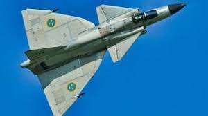

[1.] Gripen \newline
[X.] Draken \newline
[2.] Viggen

\newpage

## 9. I början av januari nästa år är det 90 år sedan Elvis föddes. Vad hette han i mellannamn?

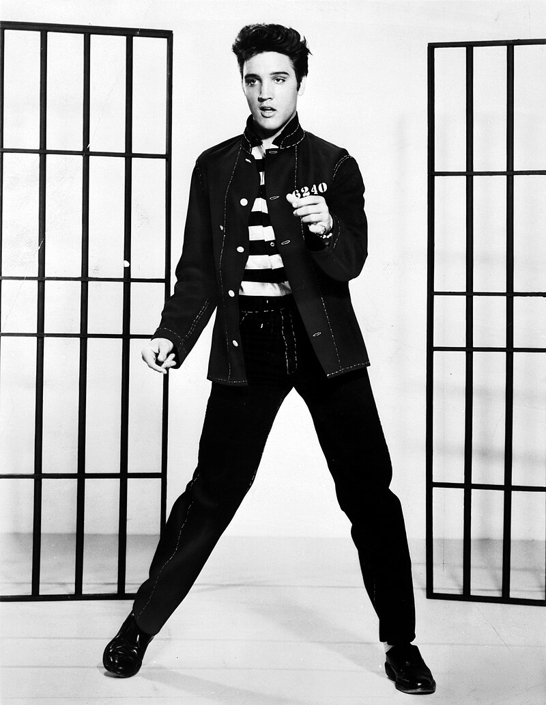{width=50%}

[1.] Aaron \newline
[X.] Jesse \newline
[2.] Vernon

\newpage

## 10. I år firar Ålands museum 90 år. Hur ser Ålands flagga ut?

[1.] 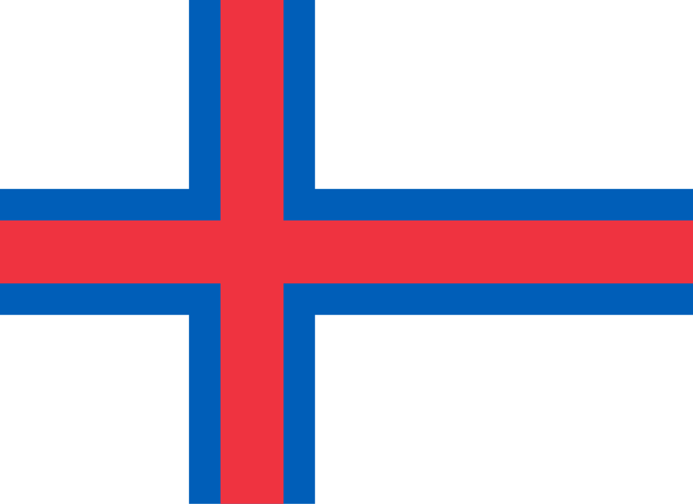{width=20%} \newline
[X.] 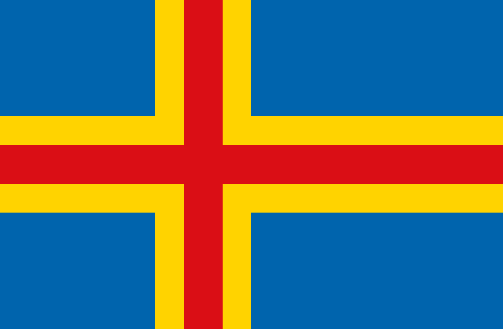{width=20%} \newline
[2.] 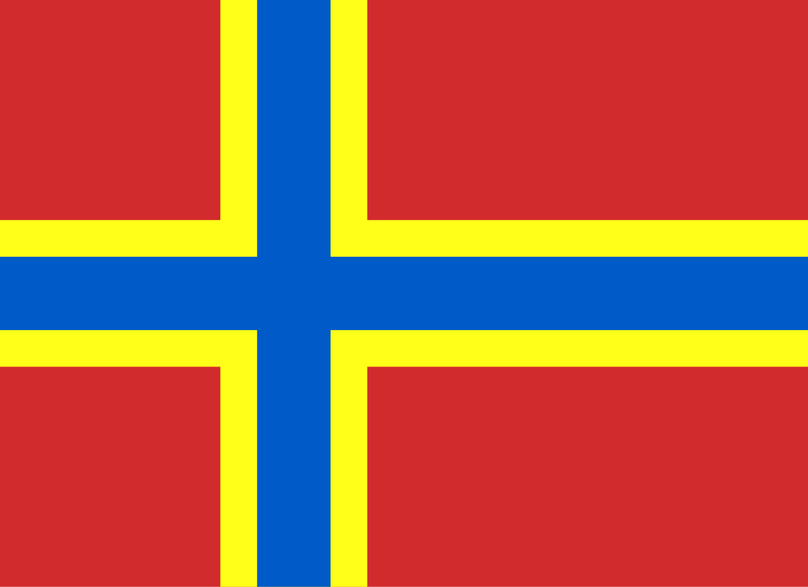{width=20%} 

\newpage

## 11. För 90 år sedan föddes Staffan Westerberg
Vilken av följande barnprogram ligger Staffan Westerberg INTE bakom

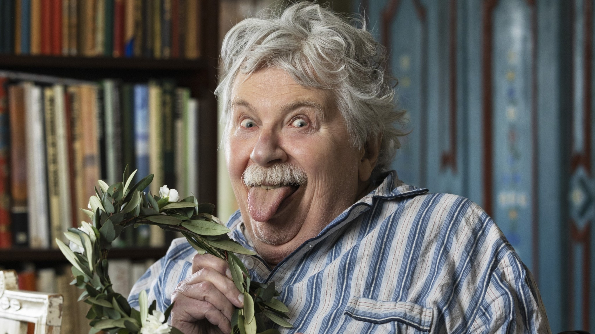

[1.] Vilse i pannkakan \newline
[X.] Tårtan \newline
[2.] Lillstrumpa och Syster Yster

\newpage

## 12. I år fyller Linköpings kanotklubb 90 år...
Kanot är ett samlingsnamn för olika mindre, smala vattenfarkoster som vanligen drivs framåt med hjälp av muskelkraft och paddel. Vad heter denna kanotist som vann OS-guld 1996 och som precis som Joakim och Maria växte upp i Katrineholm? 

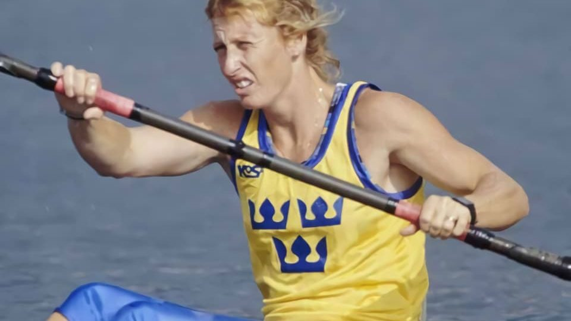

[1.] Susanne Gunnarsson \newline
[X.] Agneta Andersson \newline
[2.] Hedvig Lindahl
